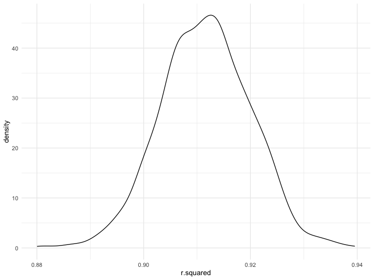
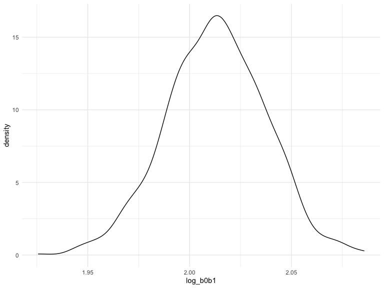
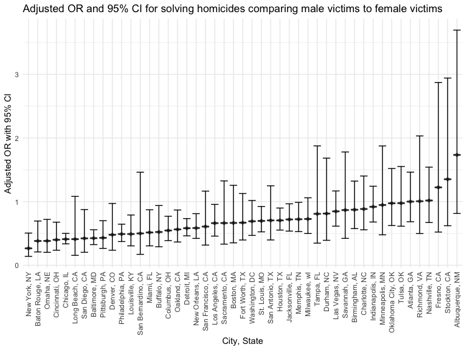
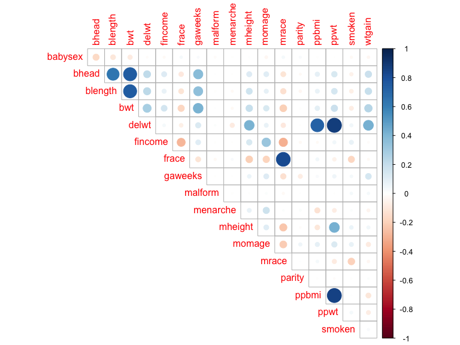
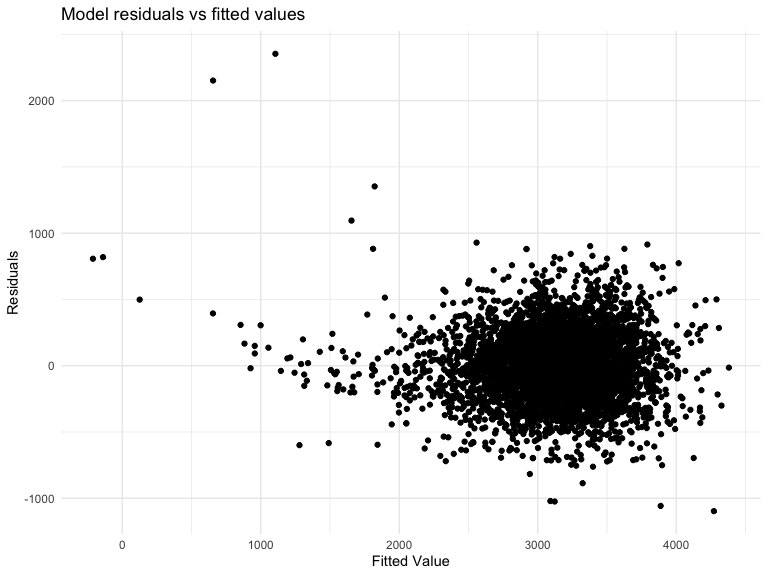
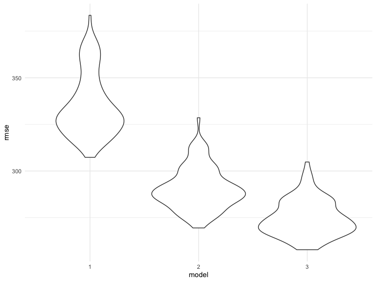

p8105_hw6_pl2848
================
Pei Liu
2022-12-01

``` r
# Loaded the library
library(tidyverse)
```

    ## ── Attaching packages ─────────────────────────────────────── tidyverse 1.3.2 ──
    ## ✔ ggplot2 3.3.6      ✔ purrr   0.3.4 
    ## ✔ tibble  3.1.8      ✔ dplyr   1.0.10
    ## ✔ tidyr   1.2.0      ✔ stringr 1.4.1 
    ## ✔ readr   2.1.2      ✔ forcats 0.5.2 
    ## ── Conflicts ────────────────────────────────────────── tidyverse_conflicts() ──
    ## ✖ dplyr::filter() masks stats::filter()
    ## ✖ dplyr::lag()    masks stats::lag()

``` r
library(dplyr)
library(viridis)
```

    ## Loading required package: viridisLite

``` r
library(viridisLite)
library(glmnet)
```

    ## Loading required package: Matrix
    ## 
    ## Attaching package: 'Matrix'
    ## 
    ## The following objects are masked from 'package:tidyr':
    ## 
    ##     expand, pack, unpack
    ## 
    ## Loaded glmnet 4.1-4

``` r
library(modelr)
library(ggplot2)
library(forcats)
library(corrplot)
```

    ## corrplot 0.92 loaded

``` r
library(mgcv)
```

    ## Loading required package: nlme
    ## 
    ## Attaching package: 'nlme'
    ## 
    ## The following object is masked from 'package:dplyr':
    ## 
    ##     collapse
    ## 
    ## This is mgcv 1.8-40. For overview type 'help("mgcv-package")'.

``` r
knitr::opts_chunk$set(
    echo = TRUE,
    warning = FALSE,
    fig.width = 8, 
  fig.height = 6,
  out.width = "90%"
)

options(
  ggplot2.continuous.colour = "viridis",
  ggplot2.continuous.fill = "viridis"
)

scale_colour_discrete = scale_colour_viridis_d
scale_fill_discrete = scale_fill_viridis_d

theme_set(theme_minimal() + theme(legend.position = "bottom"))
```

### Problem 1

To obtain a distribution for $\hat{r}^2$, we’ll follow basically the
same procedure we used for regression coefficients: draw bootstrap
samples; the a model to each; extract the value I’m concerned with; and
summarize. Here, we’ll use `modelr::bootstrap` to draw the samples and
`broom::glance` to produce `r.squared` values.

``` r
weather_df = 
  rnoaa::meteo_pull_monitors(
    c("USW00094728"),
    var = c("PRCP", "TMIN", "TMAX"), 
    date_min = "2017-01-01",
    date_max = "2017-12-31") %>%
  mutate(
    name = recode(id, USW00094728 = "CentralPark_NY"),
    tmin = tmin / 10,
    tmax = tmax / 10) %>%
  select(name, id, everything())
```

    ## Registered S3 method overwritten by 'hoardr':
    ##   method           from
    ##   print.cache_info httr

    ## using cached file: ~/Library/Caches/R/noaa_ghcnd/USW00094728.dly

    ## date created (size, mb): 2022-09-29 10:42:05 (8.401)

    ## file min/max dates: 1869-01-01 / 2022-09-30

``` r
weather_df %>% 
  modelr::bootstrap(n = 1000) %>% 
  mutate(
    models = map(strap, ~lm(tmax ~ tmin, data = .x) ),
    results = map(models, broom::glance)) %>% 
  select(-strap, -models) %>% 
  unnest(results) %>% 
  ggplot(aes(x = r.squared)) + geom_density()
```



In this example, the $\hat{r}^2$ value is high, and the upper bound at 1
may be a cause for the generally skewed shape of the distribution. If we
wanted to construct a confidence interval for $R^2$, we could take the
2.5% and 97.5% quantiles of the estimates across bootstrap samples.
However, because the shape isn’t symmetric, using the mean +/- 1.96
times the standard error probably wouldn’t work well.

We can produce a distribution for $\log(\beta_0 * \beta1)$ using a
similar approach, with a bit more wrangling before we make our plot.

``` r
weather_df %>% 
  modelr::bootstrap(n = 1000) %>% 
  mutate(
    models = map(strap, ~lm(tmax ~ tmin, data = .x) ),
    results = map(models, broom::tidy)) %>% 
  select(-strap, -models) %>% 
  unnest(results) %>% 
  select(id = `.id`, term, estimate) %>% 
  pivot_wider(
    names_from = term, 
    values_from = estimate) %>% 
  rename(beta0 = `(Intercept)`, beta1 = tmin) %>% 
  mutate(log_b0b1 = log(beta0 * beta1)) %>% 
  ggplot(aes(x = log_b0b1)) + geom_density()
```



As with $r^2$, this distribution is somewhat skewed and has some
outliers.

The point of this is not to say you should always use the bootstrap –
it’s possible to establish “large sample” distributions for strange
parameters / values / summaries in a lot of cases, and those are great
to have. But it is helpful to know that there’s a way to do inference
even in tough cases.

### Problem 2

``` r
# read the data
homicide = read_csv("data/homicide-data.csv") %>% 
  janitor::clean_names() %>% 
  mutate(city_state = str_c(city, ", ", state),
         solve_status = as.factor(ifelse(disposition == "Closed by arrest", 1, 0)),
         victim_age = as.numeric(victim_age)) %>% 
  filter(!city_state %in% c("Dallas, TX", "Phoenix, AZ",  "Kansas City, MO", "Tulsa, AL") &
           victim_sex != "Unknown" &
         victim_race %in% c("White" ,"Black"))%>% 
  drop_na()
```

    ## Rows: 52179 Columns: 12
    ## ── Column specification ────────────────────────────────────────────────────────
    ## Delimiter: ","
    ## chr (9): uid, victim_last, victim_first, victim_race, victim_age, victim_sex...
    ## dbl (3): reported_date, lat, lon
    ## 
    ## ℹ Use `spec()` to retrieve the full column specification for this data.
    ## ℹ Specify the column types or set `show_col_types = FALSE` to quiet this message.

``` r
homicide
```

    ## # A tibble: 39,320 × 14
    ##    uid   repor…¹ victi…² victi…³ victi…⁴ victi…⁵ victi…⁶ city  state   lat   lon
    ##    <chr>   <dbl> <chr>   <chr>   <chr>     <dbl> <chr>   <chr> <chr> <dbl> <dbl>
    ##  1 Alb-…  2.01e7 SATTER… VIVIANA White        15 Female  Albu… NM     35.1 -107.
    ##  2 Alb-…  2.01e7 MULA    VIVIAN  White        72 Female  Albu… NM     35.1 -107.
    ##  3 Alb-…  2.01e7 BOOK    GERALD… White        91 Female  Albu… NM     35.2 -107.
    ##  4 Alb-…  2.01e7 MARTIN… GUSTAVO White        56 Male    Albu… NM     35.1 -107.
    ##  5 Alb-…  2.01e7 GRAY    STEFAN… White        43 Female  Albu… NM     35.1 -107.
    ##  6 Alb-…  2.01e7 BRITO   ELIZAB… White        22 Female  Albu… NM     35.1 -107.
    ##  7 Alb-…  2.01e7 KING    TEVION  Black        15 Male    Albu… NM     35.1 -107.
    ##  8 Alb-…  2.01e7 BOYKIN  CEDRIC  Black        25 Male    Albu… NM     35.1 -107.
    ##  9 Alb-…  2.01e7 BARRAG… MIGUEL  White        20 Male    Albu… NM     35.1 -107.
    ## 10 Alb-…  2.01e7 WRONSKI VIOLA   White        88 Female  Albu… NM     35.1 -107.
    ## # … with 39,310 more rows, 3 more variables: disposition <chr>,
    ## #   city_state <chr>, solve_status <fct>, and abbreviated variable names
    ## #   ¹​reported_date, ²​victim_last, ³​victim_first, ⁴​victim_race, ⁵​victim_age,
    ## #   ⁶​victim_sex

Obtain the estimate and confidence interval of the adjusted odds ratio
for solving homicides comparing male victims to female victims keeping
all other variables fixed, stored the result in fit_logistic_MD.

``` r
fit_logistic_MD = 
  homicide %>% 
  filter(city_state == "Baltimore, MD") %>% 
  mutate(victim_sex = as.factor(victim_sex)) %>% 
  glm(solve_status ~ victim_age + victim_race + victim_sex, data = ., family = binomial()) %>% 
  broom::tidy() %>% 
  mutate(OR = exp(estimate),
         lower_ci = exp(estimate - std.error*1.96),
         upper_ci = exp(estimate + std.error*1.96)) %>%
  select(term, OR, lower_ci, upper_ci) %>% 
  filter(term == "victim_sexMale") %>% 
  knitr::kable(digits = 3) 


fit_logistic_MD
```

| term           |    OR | lower_ci | upper_ci |
|:---------------|------:|---------:|---------:|
| victim_sexMale | 0.426 |    0.325 |    0.558 |

``` r
# Build a function to do logistic regression and return the result
fit_logistic = function(citystate) {
  
  result = homicide %>% 
  filter(city_state == citystate) %>% 
  glm(solve_status ~ victim_age + victim_race + victim_sex, data = ., family = binomial()) %>% 
  broom::tidy() %>% 
  mutate(OR = exp(estimate),
         lower_ci = exp(estimate - std.error*1.96),
         upper_ci = exp(estimate + std.error*1.96)) %>%
  select(term, OR, lower_ci, upper_ci) %>% 
    filter(term == "victim_sexMale")
  
  return(result)

  }
 
# Apply the function to each city state
logistic_reg_city_state = tibble(city_state = unique(homicide$city_state),
       result = map(city_state, fit_logistic)) %>% 
  unnest()


logistic_reg_city_state
```

    ## # A tibble: 47 × 5
    ##    city_state      term              OR lower_ci upper_ci
    ##    <chr>           <chr>          <dbl>    <dbl>    <dbl>
    ##  1 Albuquerque, NM victim_sexMale 1.73     0.814    3.70 
    ##  2 Atlanta, GA     victim_sexMale 1.00     0.684    1.46 
    ##  3 Baltimore, MD   victim_sexMale 0.426    0.325    0.558
    ##  4 Baton Rouge, LA victim_sexMale 0.381    0.209    0.695
    ##  5 Birmingham, AL  victim_sexMale 0.873    0.576    1.32 
    ##  6 Boston, MA      victim_sexMale 0.665    0.352    1.26 
    ##  7 Buffalo, NY     victim_sexMale 0.522    0.291    0.939
    ##  8 Charlotte, NC   victim_sexMale 0.884    0.557    1.40 
    ##  9 Chicago, IL     victim_sexMale 0.410    0.336    0.501
    ## 10 Cincinnati, OH  victim_sexMale 0.400    0.236    0.677
    ## # … with 37 more rows

Create a plot that shows the estimated ORs and CIs for each city.
Organize cities according to estimated OR, and comment on the plot.

The boxplot shows adjusted ORs and 95% of each city in the US. New York
has lowest adjusted odds ratio for solving homicides comparing male
victims to female victims keeping all other variables fixed, while
Albuquerque has the high odds ratio. Most of the cities have odds ratio
smaller than 1. Fresno, stockton and Albuquerque have very wide
confidence interval compared with others. COnfidence interval for cities
with larger ORs is also higher.

``` r
# Created the boxplot of estimated OR and its 95% CI 
plot1 = logistic_reg_city_state %>% 
  mutate(city_state = fct_reorder(city_state, OR)) %>% 
  ggplot(aes(x = city_state, y = OR))+ 
  geom_point(alpha = .5) +
  geom_boxplot() + 
  geom_errorbar(aes(ymin = lower_ci, ymax = upper_ci), width = 0.8) +
  labs(
    title = "Adjusted OR and 95% CI for solving homicides comparing male victims to female victims",
    x = "City, State",
    y = "Adjusted OR with 95% CI"
  ) +
  theme(legend.position = "bottom",
        axis.text.x = element_text(angle = 90, vjust = 0.5, hjust=1)) 

# We can see that New York, NY has the lowest the odds ratio for solving homicides comparing male victims to female victims, while Albuquerque, NM has the highet (hoding other variables fixed). The confidence interval for the city states with higher ORs are larger compared with some cities with small ORs.
plot1
```



### Problem 3

``` r
# Import the data
birthweight = read_csv("data/birthweight.csv") 
```

    ## Rows: 4342 Columns: 20
    ## ── Column specification ────────────────────────────────────────────────────────
    ## Delimiter: ","
    ## dbl (20): babysex, bhead, blength, bwt, delwt, fincome, frace, gaweeks, malf...
    ## 
    ## ℹ Use `spec()` to retrieve the full column specification for this data.
    ## ℹ Specify the column types or set `show_col_types = FALSE` to quiet this message.

``` r
birthweight
```

    ## # A tibble: 4,342 × 20
    ##    babysex bhead blength   bwt delwt fincome frace gaweeks malform menarche
    ##      <dbl> <dbl>   <dbl> <dbl> <dbl>   <dbl> <dbl>   <dbl>   <dbl>    <dbl>
    ##  1       2    34      51  3629   177      35     1    39.9       0       13
    ##  2       1    34      48  3062   156      65     2    25.9       0       14
    ##  3       2    36      50  3345   148      85     1    39.9       0       12
    ##  4       1    34      52  3062   157      55     1    40         0       14
    ##  5       2    34      52  3374   156       5     1    41.6       0       13
    ##  6       1    33      52  3374   129      55     1    40.7       0       12
    ##  7       2    33      46  2523   126      96     2    40.3       0       14
    ##  8       2    33      49  2778   140       5     1    37.4       0       12
    ##  9       1    36      52  3515   146      85     1    40.3       0       11
    ## 10       1    33      50  3459   169      75     2    40.7       0       12
    ## # … with 4,332 more rows, and 10 more variables: mheight <dbl>, momage <dbl>,
    ## #   mrace <dbl>, parity <dbl>, pnumlbw <dbl>, pnumsga <dbl>, ppbmi <dbl>,
    ## #   ppwt <dbl>, smoken <dbl>, wtgain <dbl>

``` r
# Check missing values, there is no missing value for every column.
colSums(is.na(birthweight))
```

    ##  babysex    bhead  blength      bwt    delwt  fincome    frace  gaweeks 
    ##        0        0        0        0        0        0        0        0 
    ##  malform menarche  mheight   momage    mrace   parity  pnumlbw  pnumsga 
    ##        0        0        0        0        0        0        0        0 
    ##    ppbmi     ppwt   smoken   wtgain 
    ##        0        0        0        0

``` r
# check unique values for each columns. For pnumlbw and pnumsga, we only have one unique value 0, so there is no need to include these variables into our model.
apply(birthweight, 2, function(x) length(unique(x)))
```

    ##  babysex    bhead  blength      bwt    delwt  fincome    frace  gaweeks 
    ##        2       20       29      130      154       12        5      175 
    ##  malform menarche  mheight   momage    mrace   parity  pnumlbw  pnumsga 
    ##        2       14       26       33        4        4        1        1 
    ##    ppbmi     ppwt   smoken   wtgain 
    ##      798      133       33       93

``` r
unique(birthweight$pnumlbw)
```

    ## [1] 0

``` r
unique(birthweight$pnumsga)
```

    ## [1] 0

To get an overview of coeffienits between variables, I make the
corelation matrix and displayed it via heat map.

``` r
# correlation plot. Deleted two variables that only have one unique value.
correlation_plot = birthweight %>% 
  select(-pnumlbw, -pnumsga) %>% 
  cor() %>% 
  corrplot(type = "upper", diag = FALSE)
```



``` r
correlation_plot
```

    ## $corr
    ##               babysex        bhead      blength          bwt        delwt
    ## babysex   1.000000000 -0.168800453 -0.105288240 -0.086641788 -0.016419382
    ## bhead    -0.168800453  1.000000000  0.630454800  0.747106776  0.214370719
    ## blength  -0.105288240  0.630454800  1.000000000  0.743450753  0.229149444
    ## bwt      -0.086641788  0.747106776  0.743450753  1.000000000  0.287889306
    ## delwt    -0.016419382  0.214370719  0.229149444  0.287889306  1.000000000
    ## fincome  -0.022642956  0.115699146  0.078745057  0.154571511  0.034994354
    ## frace     0.030927740 -0.096080105 -0.113357087 -0.179390010 -0.064849608
    ## gaweeks   0.020240367  0.378456488  0.359263675  0.412183348  0.124278465
    ## malform  -0.018032531  0.002996998 -0.009021499  0.001333249  0.012094278
    ## menarche -0.006286522 -0.003016051 -0.021067386 -0.024424664 -0.085940103
    ## mheight   0.007735868  0.116948174  0.160259849  0.192163204  0.411257622
    ## momage   -0.037178242  0.108081296  0.080160314  0.135773400  0.074040925
    ## mrace     0.036021274 -0.110141965 -0.132483530 -0.207668944 -0.092238299
    ## parity    0.022998017 -0.020039523 -0.032470081 -0.008374112 -0.004709123
    ## ppbmi    -0.006993810  0.086556495  0.074015773  0.093945729  0.720504055
    ## ppwt     -0.001007045  0.136608829  0.148604640  0.182891964  0.870913274
    ## smoken   -0.027754251 -0.053947231 -0.065628829 -0.075627807  0.048612734
    ## wtgain   -0.031461915  0.183333740  0.191223763  0.247252588  0.424788310
    ##               fincome       frace       gaweeks       malform      menarche
    ## babysex  -0.022642956  0.03092774  0.0202403675 -0.0180325312 -0.0062865218
    ## bhead     0.115699146 -0.09608011  0.3784564882  0.0029969977 -0.0030160515
    ## blength   0.078745057 -0.11335709  0.3592636747 -0.0090214992 -0.0210673863
    ## bwt       0.154571511 -0.17939001  0.4121833483  0.0013332488 -0.0244246642
    ## delwt     0.034994354 -0.06484961  0.1242784648  0.0120942777 -0.0859401032
    ## fincome   1.000000000 -0.28459212  0.1066776727 -0.0068882129 -0.0035350852
    ## frace    -0.284592120  1.00000000 -0.1137273091 -0.0268645071  0.0212101015
    ## gaweeks   0.106677673 -0.11372731  1.0000000000 -0.0050945358 -0.0004362693
    ## malform  -0.006888213 -0.02686451 -0.0050945358  1.0000000000 -0.0098672735
    ## menarche -0.003535085  0.02121010 -0.0004362693 -0.0098672735  1.0000000000
    ## mheight   0.131018596 -0.20087131  0.0621377387 -0.0079746200  0.0741155687
    ## momage    0.323114207 -0.18693410  0.1139098271  0.0177280547  0.1760379749
    ## mrace    -0.304811707  0.82860550 -0.1315205703 -0.0276627251  0.0134218348
    ## parity   -0.025942406  0.00117668 -0.0796588545 -0.0013177624  0.0194761938
    ## ppbmi    -0.020189000  0.04594735  0.0273358740  0.0002545075 -0.1218260802
    ## ppwt      0.047252637 -0.05961396  0.0564730379 -0.0033798843 -0.0704995875
    ## smoken    0.077943047 -0.17293364  0.0362116820  0.0331602952  0.0163746450
    ## wtgain   -0.016037706 -0.02177121  0.1481459581  0.0307670393 -0.0445137226
    ##               mheight      momage        mrace       parity         ppbmi
    ## babysex   0.007735868 -0.03717824  0.036021274  0.022998017 -0.0069938102
    ## bhead     0.116948174  0.10808130 -0.110141965 -0.020039523  0.0865564946
    ## blength   0.160259849  0.08016031 -0.132483530 -0.032470081  0.0740157734
    ## bwt       0.192163204  0.13577340 -0.207668944 -0.008374112  0.0939457290
    ## delwt     0.411257622  0.07404092 -0.092238299 -0.004709123  0.7205040550
    ## fincome   0.131018596  0.32311421 -0.304811707 -0.025942406 -0.0201890000
    ## frace    -0.200871313 -0.18693410  0.828605502  0.001176680  0.0459473547
    ## gaweeks   0.062137739  0.11390983 -0.131520570 -0.079658854  0.0273358740
    ## malform  -0.007974620  0.01772805 -0.027662725 -0.001317762  0.0002545075
    ## menarche  0.074115569  0.17603797  0.013421835  0.019476194 -0.1218260802
    ## mheight   1.000000000  0.10904804 -0.230425440 -0.013423739 -0.1007377489
    ## momage    0.109048035  1.00000000 -0.211600003  0.051954243  0.0812451229
    ## mrace    -0.230425440 -0.21160000  1.000000000  0.002117682  0.0348431735
    ## parity   -0.013423739  0.05195424  0.002117682  1.000000000 -0.0059266742
    ## ppbmi    -0.100737749  0.08124512  0.034843174 -0.005926674  1.0000000000
    ## ppwt      0.426687241  0.12959210 -0.084248225 -0.011202947  0.8533167629
    ## smoken    0.060983516  0.07545435 -0.197517866 -0.005575698  0.0070229798
    ## wtgain    0.048478926 -0.08848760 -0.031966724  0.011081927 -0.1099295765
    ##                  ppwt       smoken      wtgain
    ## babysex  -0.001007045 -0.027754251 -0.03146191
    ## bhead     0.136608829 -0.053947231  0.18333374
    ## blength   0.148604640 -0.065628829  0.19122376
    ## bwt       0.182891964 -0.075627807  0.24725259
    ## delwt     0.870913274  0.048612734  0.42478831
    ## fincome   0.047252637  0.077943047 -0.01603771
    ## frace    -0.059613957 -0.172933640 -0.02177121
    ## gaweeks   0.056473038  0.036211682  0.14814596
    ## malform  -0.003379884  0.033160295  0.03076704
    ## menarche -0.070499588  0.016374645 -0.04451372
    ## mheight   0.426687241  0.060983516  0.04847893
    ## momage    0.129592098  0.075454350 -0.08848760
    ## mrace    -0.084248225 -0.197517866 -0.03196672
    ## parity   -0.011202947 -0.005575698  0.01108193
    ## ppbmi     0.853316763  0.007022980 -0.10992958
    ## ppwt      1.000000000  0.038854748 -0.07494032
    ## smoken    0.038854748  1.000000000  0.02706577
    ## wtgain   -0.074940321  0.027065774  1.00000000
    ## 
    ## $corrPos
    ##        xName    yName  x  y          corr
    ## 1      bhead  babysex  2 18 -0.1688004529
    ## 2    blength  babysex  3 18 -0.1052882398
    ## 3    blength    bhead  3 17  0.6304548002
    ## 4        bwt  babysex  4 18 -0.0866417876
    ## 5        bwt    bhead  4 17  0.7471067756
    ## 6        bwt  blength  4 16  0.7434507532
    ## 7      delwt  babysex  5 18 -0.0164193824
    ## 8      delwt    bhead  5 17  0.2143707191
    ## 9      delwt  blength  5 16  0.2291494436
    ## 10     delwt      bwt  5 15  0.2878893064
    ## 11   fincome  babysex  6 18 -0.0226429560
    ## 12   fincome    bhead  6 17  0.1156991455
    ## 13   fincome  blength  6 16  0.0787450570
    ## 14   fincome      bwt  6 15  0.1545715106
    ## 15   fincome    delwt  6 14  0.0349943537
    ## 16     frace  babysex  7 18  0.0309277396
    ## 17     frace    bhead  7 17 -0.0960801050
    ## 18     frace  blength  7 16 -0.1133570867
    ## 19     frace      bwt  7 15 -0.1793900104
    ## 20     frace    delwt  7 14 -0.0648496078
    ## 21     frace  fincome  7 13 -0.2845921200
    ## 22   gaweeks  babysex  8 18  0.0202403675
    ## 23   gaweeks    bhead  8 17  0.3784564882
    ## 24   gaweeks  blength  8 16  0.3592636747
    ## 25   gaweeks      bwt  8 15  0.4121833483
    ## 26   gaweeks    delwt  8 14  0.1242784648
    ## 27   gaweeks  fincome  8 13  0.1066776727
    ## 28   gaweeks    frace  8 12 -0.1137273091
    ## 29   malform  babysex  9 18 -0.0180325312
    ## 30   malform    bhead  9 17  0.0029969977
    ## 31   malform  blength  9 16 -0.0090214992
    ## 32   malform      bwt  9 15  0.0013332488
    ## 33   malform    delwt  9 14  0.0120942777
    ## 34   malform  fincome  9 13 -0.0068882129
    ## 35   malform    frace  9 12 -0.0268645071
    ## 36   malform  gaweeks  9 11 -0.0050945358
    ## 37  menarche  babysex 10 18 -0.0062865218
    ## 38  menarche    bhead 10 17 -0.0030160515
    ## 39  menarche  blength 10 16 -0.0210673863
    ## 40  menarche      bwt 10 15 -0.0244246642
    ## 41  menarche    delwt 10 14 -0.0859401032
    ## 42  menarche  fincome 10 13 -0.0035350852
    ## 43  menarche    frace 10 12  0.0212101015
    ## 44  menarche  gaweeks 10 11 -0.0004362693
    ## 45  menarche  malform 10 10 -0.0098672735
    ## 46   mheight  babysex 11 18  0.0077358685
    ## 47   mheight    bhead 11 17  0.1169481744
    ## 48   mheight  blength 11 16  0.1602598491
    ## 49   mheight      bwt 11 15  0.1921632044
    ## 50   mheight    delwt 11 14  0.4112576221
    ## 51   mheight  fincome 11 13  0.1310185959
    ## 52   mheight    frace 11 12 -0.2008713129
    ## 53   mheight  gaweeks 11 11  0.0621377387
    ## 54   mheight  malform 11 10 -0.0079746200
    ## 55   mheight menarche 11  9  0.0741155687
    ## 56    momage  babysex 12 18 -0.0371782421
    ## 57    momage    bhead 12 17  0.1080812964
    ## 58    momage  blength 12 16  0.0801603141
    ## 59    momage      bwt 12 15  0.1357734003
    ## 60    momage    delwt 12 14  0.0740409247
    ## 61    momage  fincome 12 13  0.3231142065
    ## 62    momage    frace 12 12 -0.1869341049
    ## 63    momage  gaweeks 12 11  0.1139098271
    ## 64    momage  malform 12 10  0.0177280547
    ## 65    momage menarche 12  9  0.1760379749
    ## 66    momage  mheight 12  8  0.1090480354
    ## 67     mrace  babysex 13 18  0.0360212741
    ## 68     mrace    bhead 13 17 -0.1101419654
    ## 69     mrace  blength 13 16 -0.1324835303
    ## 70     mrace      bwt 13 15 -0.2076689437
    ## 71     mrace    delwt 13 14 -0.0922382990
    ## 72     mrace  fincome 13 13 -0.3048117068
    ## 73     mrace    frace 13 12  0.8286055023
    ## 74     mrace  gaweeks 13 11 -0.1315205703
    ## 75     mrace  malform 13 10 -0.0276627251
    ## 76     mrace menarche 13  9  0.0134218348
    ## 77     mrace  mheight 13  8 -0.2304254403
    ## 78     mrace   momage 13  7 -0.2116000031
    ## 79    parity  babysex 14 18  0.0229980173
    ## 80    parity    bhead 14 17 -0.0200395231
    ## 81    parity  blength 14 16 -0.0324700813
    ## 82    parity      bwt 14 15 -0.0083741121
    ## 83    parity    delwt 14 14 -0.0047091226
    ## 84    parity  fincome 14 13 -0.0259424062
    ## 85    parity    frace 14 12  0.0011766803
    ## 86    parity  gaweeks 14 11 -0.0796588545
    ## 87    parity  malform 14 10 -0.0013177624
    ## 88    parity menarche 14  9  0.0194761938
    ## 89    parity  mheight 14  8 -0.0134237391
    ## 90    parity   momage 14  7  0.0519542428
    ## 91    parity    mrace 14  6  0.0021176816
    ## 92     ppbmi  babysex 15 18 -0.0069938102
    ## 93     ppbmi    bhead 15 17  0.0865564946
    ## 94     ppbmi  blength 15 16  0.0740157734
    ## 95     ppbmi      bwt 15 15  0.0939457290
    ## 96     ppbmi    delwt 15 14  0.7205040550
    ## 97     ppbmi  fincome 15 13 -0.0201890000
    ## 98     ppbmi    frace 15 12  0.0459473547
    ## 99     ppbmi  gaweeks 15 11  0.0273358740
    ## 100    ppbmi  malform 15 10  0.0002545075
    ## 101    ppbmi menarche 15  9 -0.1218260802
    ## 102    ppbmi  mheight 15  8 -0.1007377489
    ## 103    ppbmi   momage 15  7  0.0812451229
    ## 104    ppbmi    mrace 15  6  0.0348431735
    ## 105    ppbmi   parity 15  5 -0.0059266742
    ## 106     ppwt  babysex 16 18 -0.0010070451
    ## 107     ppwt    bhead 16 17  0.1366088292
    ## 108     ppwt  blength 16 16  0.1486046398
    ## 109     ppwt      bwt 16 15  0.1828919639
    ## 110     ppwt    delwt 16 14  0.8709132735
    ## 111     ppwt  fincome 16 13  0.0472526374
    ## 112     ppwt    frace 16 12 -0.0596139569
    ## 113     ppwt  gaweeks 16 11  0.0564730379
    ## 114     ppwt  malform 16 10 -0.0033798843
    ## 115     ppwt menarche 16  9 -0.0704995875
    ## 116     ppwt  mheight 16  8  0.4266872406
    ## 117     ppwt   momage 16  7  0.1295920977
    ## 118     ppwt    mrace 16  6 -0.0842482254
    ## 119     ppwt   parity 16  5 -0.0112029473
    ## 120     ppwt    ppbmi 16  4  0.8533167629
    ## 121   smoken  babysex 17 18 -0.0277542515
    ## 122   smoken    bhead 17 17 -0.0539472314
    ## 123   smoken  blength 17 16 -0.0656288288
    ## 124   smoken      bwt 17 15 -0.0756278067
    ## 125   smoken    delwt 17 14  0.0486127339
    ## 126   smoken  fincome 17 13  0.0779430472
    ## 127   smoken    frace 17 12 -0.1729336400
    ## 128   smoken  gaweeks 17 11  0.0362116820
    ## 129   smoken  malform 17 10  0.0331602952
    ## 130   smoken menarche 17  9  0.0163746450
    ## 131   smoken  mheight 17  8  0.0609835158
    ## 132   smoken   momage 17  7  0.0754543503
    ## 133   smoken    mrace 17  6 -0.1975178659
    ## 134   smoken   parity 17  5 -0.0055756984
    ## 135   smoken    ppbmi 17  4  0.0070229798
    ## 136   smoken     ppwt 17  3  0.0388547481
    ## 137   wtgain  babysex 18 18 -0.0314619148
    ## 138   wtgain    bhead 18 17  0.1833337403
    ## 139   wtgain  blength 18 16  0.1912237632
    ## 140   wtgain      bwt 18 15  0.2472525879
    ## 141   wtgain    delwt 18 14  0.4247883101
    ## 142   wtgain  fincome 18 13 -0.0160377059
    ## 143   wtgain    frace 18 12 -0.0217712077
    ## 144   wtgain  gaweeks 18 11  0.1481459581
    ## 145   wtgain  malform 18 10  0.0307670393
    ## 146   wtgain menarche 18  9 -0.0445137226
    ## 147   wtgain  mheight 18  8  0.0484789263
    ## 148   wtgain   momage 18  7 -0.0884876010
    ## 149   wtgain    mrace 18  6 -0.0319667236
    ## 150   wtgain   parity 18  5  0.0110819267
    ## 151   wtgain    ppbmi 18  4 -0.1099295765
    ## 152   wtgain     ppwt 18  3 -0.0749403212
    ## 153   wtgain   smoken 18  2  0.0270657737
    ## 
    ## $arg
    ## $arg$type
    ## [1] "upper"

According to the heat map, the variables that have relatively high
correlation to bwt are: blength, bhead, gaweeks.

Since I want to use a mlr model and our x is less than 20 (but still a
lot), so I can use stepwise selection to get the optimal model.

First, I fit regression using all variables

``` r
# Prepare a clean dataset
brw_clean = birthweight %>% 
  select(-pnumlbw, -pnumsga) %>% 
  mutate(babysex = as.factor(babysex),
         frace = as.factor(frace),
         malform = as.factor(malform),
         mrace = as.factor(mrace))

# fit regression using all predictors
mult.fit = lm(bwt ~ ., data = brw_clean)
summary(mult.fit)
```

    ## 
    ## Call:
    ## lm(formula = bwt ~ ., data = brw_clean)
    ## 
    ## Residuals:
    ##      Min       1Q   Median       3Q      Max 
    ## -1097.68  -184.86    -3.33   173.09  2344.15 
    ## 
    ## Coefficients: (1 not defined because of singularities)
    ##               Estimate Std. Error t value Pr(>|t|)    
    ## (Intercept) -6265.3914   660.4011  -9.487  < 2e-16 ***
    ## babysex2       28.7073     8.4652   3.391 0.000702 ***
    ## bhead         130.7781     3.4523  37.881  < 2e-16 ***
    ## blength        74.9536     2.0217  37.075  < 2e-16 ***
    ## delwt           4.1007     0.3948  10.386  < 2e-16 ***
    ## fincome         0.2898     0.1795   1.614 0.106551    
    ## frace2         14.3313    46.1501   0.311 0.756168    
    ## frace3         21.2361    69.2960   0.306 0.759273    
    ## frace4        -46.9962    44.6782  -1.052 0.292912    
    ## frace8          4.2969    74.0741   0.058 0.953745    
    ## gaweeks        11.5494     1.4654   7.882 4.06e-15 ***
    ## malform1        9.7650    70.6259   0.138 0.890039    
    ## menarche       -3.5508     2.8951  -1.226 0.220083    
    ## mheight         9.7874    10.3116   0.949 0.342588    
    ## momage          0.7593     1.2221   0.621 0.534418    
    ## mrace2       -151.4354    46.0453  -3.289 0.001014 ** 
    ## mrace3        -91.3866    71.9190  -1.271 0.203908    
    ## mrace4        -56.4787    45.1369  -1.251 0.210901    
    ## parity         95.5411    40.4793   2.360 0.018307 *  
    ## ppbmi           4.3538    14.8913   0.292 0.770017    
    ## ppwt           -3.4716     2.6121  -1.329 0.183913    
    ## smoken         -4.8544     0.5871  -8.269  < 2e-16 ***
    ## wtgain              NA         NA      NA       NA    
    ## ---
    ## Signif. codes:  0 '***' 0.001 '**' 0.01 '*' 0.05 '.' 0.1 ' ' 1
    ## 
    ## Residual standard error: 272.5 on 4320 degrees of freedom
    ## Multiple R-squared:  0.7183, Adjusted R-squared:  0.717 
    ## F-statistic: 524.6 on 21 and 4320 DF,  p-value: < 2.2e-16

Then, the idea is to combine forward and backward selction based on AIC.
Here, I use one function to help me to do it.

The call modelis:

Call:

lm(formula = bwt \~ babysex + bhead + blength + delwt + fincome +
gaweeks + mheight + mrace + parity + ppwt + smoken, data = brw_clean)

I think the best_mlr makes sense, because the variables that have low
correlations are excluded and the remaining variables are all reasonable
and could have potential effect to body weight. So I decided to use the
result from backwards elimination as my prediction model.

``` r
# The best model using stepwise selection
best_mlr = step(mult.fit, direction='both', scope = formula(mult.fit))
```

    ## Start:  AIC=48717.83
    ## bwt ~ babysex + bhead + blength + delwt + fincome + frace + gaweeks + 
    ##     malform + menarche + mheight + momage + mrace + parity + 
    ##     ppbmi + ppwt + smoken + wtgain
    ## 
    ## 
    ## Step:  AIC=48717.83
    ## bwt ~ babysex + bhead + blength + delwt + fincome + frace + gaweeks + 
    ##     malform + menarche + mheight + momage + mrace + parity + 
    ##     ppbmi + ppwt + smoken
    ## 
    ##            Df Sum of Sq       RSS   AIC
    ## - frace     4    124365 320848704 48712
    ## - malform   1      1419 320725757 48716
    ## - ppbmi     1      6346 320730684 48716
    ## - momage    1     28661 320752999 48716
    ## - mheight   1     66886 320791224 48717
    ## - menarche  1    111679 320836018 48717
    ## - ppwt      1    131132 320855470 48718
    ## <none>                  320724338 48718
    ## - fincome   1    193454 320917792 48718
    ## - parity    1    413584 321137922 48721
    ## - mrace     3    868321 321592659 48724
    ## - babysex   1    853796 321578134 48727
    ## - gaweeks   1   4611823 325336161 48778
    ## - smoken    1   5076393 325800732 48784
    ## - delwt     1   8008891 328733230 48823
    ## - blength   1 102050296 422774634 49915
    ## - bhead     1 106535716 427260054 49961
    ## 
    ## Step:  AIC=48711.51
    ## bwt ~ babysex + bhead + blength + delwt + fincome + gaweeks + 
    ##     malform + menarche + mheight + momage + mrace + parity + 
    ##     ppbmi + ppwt + smoken
    ## 
    ##            Df Sum of Sq       RSS   AIC
    ## - malform   1      1447 320850151 48710
    ## - ppbmi     1      6975 320855679 48710
    ## - momage    1     28379 320877083 48710
    ## - mheight   1     69502 320918206 48710
    ## - menarche  1    115708 320964411 48711
    ## - ppwt      1    133961 320982665 48711
    ## <none>                  320848704 48712
    ## - fincome   1    194405 321043108 48712
    ## - parity    1    414687 321263390 48715
    ## + frace     4    124365 320724338 48718
    ## - babysex   1    852133 321700837 48721
    ## - gaweeks   1   4625208 325473911 48772
    ## - smoken    1   5036389 325885093 48777
    ## - delwt     1   8013099 328861802 48817
    ## - mrace     3  13540415 334389119 48885
    ## - blength   1 101995688 422844392 49908
    ## - bhead     1 106662962 427511666 49956
    ## 
    ## Step:  AIC=48709.53
    ## bwt ~ babysex + bhead + blength + delwt + fincome + gaweeks + 
    ##     menarche + mheight + momage + mrace + parity + ppbmi + ppwt + 
    ##     smoken
    ## 
    ##            Df Sum of Sq       RSS   AIC
    ## - ppbmi     1      6928 320857079 48708
    ## - momage    1     28660 320878811 48708
    ## - mheight   1     69320 320919470 48708
    ## - menarche  1    116027 320966177 48709
    ## - ppwt      1    133894 320984044 48709
    ## <none>                  320850151 48710
    ## - fincome   1    193784 321043934 48710
    ## + malform   1      1447 320848704 48712
    ## - parity    1    414482 321264633 48713
    ## + frace     4    124393 320725757 48716
    ## - babysex   1    851279 321701430 48719
    ## - gaweeks   1   4624003 325474154 48770
    ## - smoken    1   5035195 325885346 48775
    ## - delwt     1   8029079 328879230 48815
    ## - mrace     3  13553320 334403471 48883
    ## - blength   1 102009225 422859375 49906
    ## - bhead     1 106675331 427525481 49954
    ## 
    ## Step:  AIC=48707.63
    ## bwt ~ babysex + bhead + blength + delwt + fincome + gaweeks + 
    ##     menarche + mheight + momage + mrace + parity + ppwt + smoken
    ## 
    ##            Df Sum of Sq       RSS   AIC
    ## - momage    1     29211 320886290 48706
    ## - menarche  1    117635 320974714 48707
    ## <none>                  320857079 48708
    ## - fincome   1    195199 321052278 48708
    ## + ppbmi     1      6928 320850151 48710
    ## + malform   1      1400 320855679 48710
    ## - parity    1    412984 321270064 48711
    ## + frace     4    125020 320732060 48714
    ## - babysex   1    850020 321707099 48717
    ## - mheight   1   1078673 321935752 48720
    ## - ppwt      1   2934023 323791103 48745
    ## - gaweeks   1   4621504 325478583 48768
    ## - smoken    1   5039368 325896447 48773
    ## - delwt     1   8024939 328882018 48813
    ## - mrace     3  13551444 334408523 48881
    ## - blength   1 102018559 422875638 49904
    ## - bhead     1 106821342 427678421 49953
    ## 
    ## Step:  AIC=48706.02
    ## bwt ~ babysex + bhead + blength + delwt + fincome + gaweeks + 
    ##     menarche + mheight + mrace + parity + ppwt + smoken
    ## 
    ##            Df Sum of Sq       RSS   AIC
    ## - menarche  1    100121 320986412 48705
    ## <none>                  320886290 48706
    ## - fincome   1    240800 321127090 48707
    ## + momage    1     29211 320857079 48708
    ## + ppbmi     1      7479 320878811 48708
    ## + malform   1      1678 320884612 48708
    ## - parity    1    431433 321317724 48710
    ## + frace     4    124743 320761547 48712
    ## - babysex   1    841278 321727568 48715
    ## - mheight   1   1076739 321963029 48719
    ## - ppwt      1   2913653 323799943 48743
    ## - gaweeks   1   4676469 325562760 48767
    ## - smoken    1   5045104 325931394 48772
    ## - delwt     1   8000672 328886962 48811
    ## - mrace     3  14667730 335554021 48894
    ## - blength   1 101990556 422876847 49902
    ## - bhead     1 106864308 427750598 49952
    ## 
    ## Step:  AIC=48705.38
    ## bwt ~ babysex + bhead + blength + delwt + fincome + gaweeks + 
    ##     mheight + mrace + parity + ppwt + smoken
    ## 
    ##            Df Sum of Sq       RSS   AIC
    ## <none>                  320986412 48705
    ## + menarche  1    100121 320886290 48706
    ## - fincome   1    245637 321232048 48707
    ## + momage    1     11698 320974714 48707
    ## + ppbmi     1      8823 320977589 48707
    ## + malform   1      1884 320984528 48707
    ## - parity    1    422770 321409181 48709
    ## + frace     4    128726 320857686 48712
    ## - babysex   1    846134 321832545 48715
    ## - mheight   1   1012240 321998651 48717
    ## - ppwt      1   2907049 323893461 48743
    ## - gaweeks   1   4662501 325648912 48766
    ## - smoken    1   5073849 326060260 48771
    ## - delwt     1   8137459 329123871 48812
    ## - mrace     3  14683609 335670021 48894
    ## - blength   1 102191779 423178191 49903
    ## - bhead     1 106779754 427766166 49950

``` r
best_mlr
```

    ## 
    ## Call:
    ## lm(formula = bwt ~ babysex + bhead + blength + delwt + fincome + 
    ##     gaweeks + mheight + mrace + parity + ppwt + smoken, data = brw_clean)
    ## 
    ## Coefficients:
    ## (Intercept)     babysex2        bhead      blength        delwt      fincome  
    ##   -6098.822       28.558      130.777       74.947        4.107        0.318  
    ##     gaweeks      mheight       mrace2       mrace3       mrace4       parity  
    ##      11.592        6.594     -138.792      -74.887     -100.678       96.305  
    ##        ppwt       smoken  
    ##      -2.676       -4.843

``` r
# Tidy the model and display the result in dataframe
stepwise_selection = best_mlr %>% 
  summary() %>% 
  broom::tidy()

stepwise_selection
```

    ## # A tibble: 14 × 5
    ##    term         estimate std.error statistic   p.value
    ##    <chr>           <dbl>     <dbl>     <dbl>     <dbl>
    ##  1 (Intercept) -6099.      138.       -44.3  0        
    ##  2 babysex2       28.6       8.45       3.38 7.37e-  4
    ##  3 bhead         131.        3.45      37.9  3.10e-272
    ##  4 blength        74.9       2.02      37.1  4.29e-262
    ##  5 delwt           4.11      0.392     10.5  2.26e- 25
    ##  6 fincome         0.318     0.175      1.82 6.88e-  2
    ##  7 gaweeks        11.6       1.46       7.93 2.79e- 15
    ##  8 mheight         6.59      1.78       3.69 2.23e-  4
    ##  9 mrace2       -139.        9.91     -14.0  1.21e- 43
    ## 10 mrace3        -74.9      42.3       -1.77 7.68e-  2
    ## 11 mrace4       -101.       19.3       -5.21 1.98e-  7
    ## 12 parity         96.3      40.3        2.39 1.70e-  2
    ## 13 ppwt           -2.68      0.427     -6.26 4.20e- 10
    ## 14 smoken         -4.84      0.586     -8.27 1.75e- 16

show a plot of model residuals against fitted values - use
add_predictions and add_residuals in making this plot.

``` r
# Create the dataset for the plot
residual_plot = brw_clean %>% 
  modelr::add_predictions(best_mlr)  %>% 
  modelr::add_residuals(best_mlr) %>% 
  ggplot(aes(x = pred, y = resid)) + 
  geom_point() +
  labs(
    title = "Model residuals vs fitted values",
    x = "Fitted Value",
    y = "Residuals"
  )

residual_plot
```


To compare my model to the other two, I first:

Split train and test dataset

``` r
cv_df =
  crossv_mc(brw_clean, 100) %>% 
  mutate(
    train = map(train, as_tibble),
    test = map(test, as_tibble))
```

ad then fit models to training data and obtain corresponding RMSEs for
the testing data

``` r
cv_df = cv_df %>%  
  mutate(
    model1  = map(train, ~lm(bwt ~ blength + gaweeks,data = .x)),
    model2  = map(train, ~lm(bwt ~ bhead + blength + babysex + bhead*blength + bhead*babysex + blength*babysex + bhead*blength*babysex, data = .x)),
    model3  = map(train, ~lm(bwt ~ babysex + bhead + blength + delwt + fincome + gaweeks + mheight + mrace + parity + ppwt + smoken, data = .x))) %>% 
  mutate(
    rmse_1 = map2_dbl(model1, test, ~rmse(model = .x, data = .y)),
    rmse_2 = map2_dbl(model2, test, ~rmse(model = .x, data = .y)),
    rmse_3 = map2_dbl(model3, test, ~rmse(model = .x, data = .y)))
```

Lastly, I plot the prediction error distribution for each candidate
model

``` r
plot = cv_df %>% 
  select(starts_with("rmse")) %>% 
  pivot_longer(
    everything(),
    names_to = "model", 
    values_to = "rmse",
    names_prefix = "rmse_") %>% 
  mutate(model = fct_inorder(model)) %>% 
  ggplot(aes(x = model, y = rmse)) + geom_violin()
plot
```



We can see from the violin plot that model 3 (lm(bwt \~ babysex +
bhead + blength + delwt + fincome + gaweeks + mheight + mrace + parity +
ppwt + smoken, data = .x)) has the smallest RMSE, which means that my
selected model has the highest accuracy among three tested models. That
make sense, cause I used stepwise selection, and it will return the
optimal model. Model 2 that consider interaction, also has higher
predcition accuracy. But still, I will choose my model as final model.
